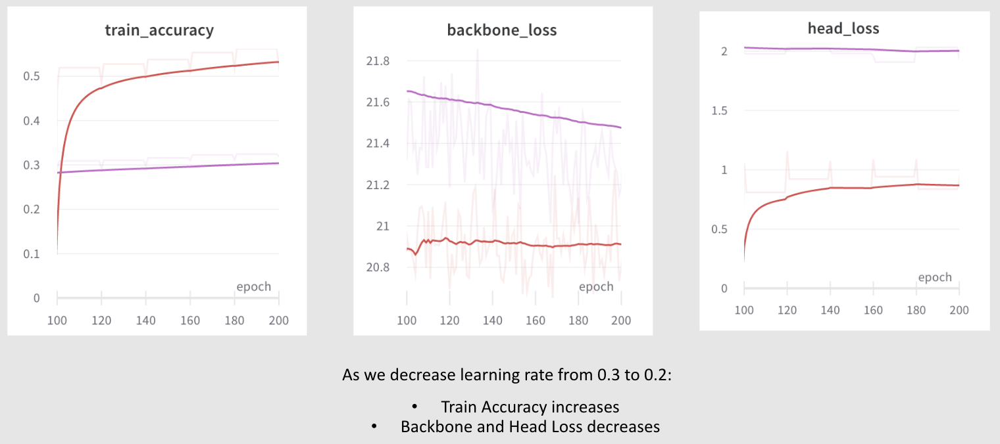
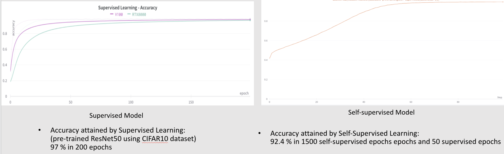

## HPML-project : Distributed Self-supervised Learning for the generation of Image Embeddings

### Goal

- Experiment with Self-supervised learning using low resolution images 
- Use Distributed Deep Learning model to create the Image Embeddings in a self-supervised manner
- Test it on downstream tasks such as Image classification and RL

### Main files

- augmentations.py: Performs different augmentations (GaussianBlur, Solarization, Normalization, RandomCrop, RandomHorizontalFlip, ColorJitter, Random grayscale conversion) on the dataset
- distributed.py: Code to perform Distributed Data Parallel
- resnet.py: ResNet50 model architecture
- train_supervised.py: Trains and evaluates ResNet50 in a self-supervised manner to get the Image Embeddings, the best model is pre-trained self-supervised backbone is saved for use in the downstream tasks 
- train_classification_downstream.py: Code to perform Image Classification using the pre-trained model saved earlier
- train_self_supervised.py: Supervised Image Classification using a pre-trained ResNet50 (for comparison between supervised and self-supervised approach)

### Run Command for Self-Supervised training
```
python -m torch.distributed.launch --nproc_per_node=2 train_self_supervised.py --arch resnet50 --epochs 100 --batch-size 32 --base-lr 0.3 --dataset CIFAR10 --data-dir ./ --run-name resnet50_run --gpu-type RTX3080
```

### Run Command for Classification Downstream Finetuning
```
python -m torch.distributed.launch --nproc_per_node=2 train_classification_downstream.py --arch resnet50 --epochs 100 --batch-size 64 --dataset CIFAR10 --data-dir ./ --run-name downstream_classification --gpu-type RTX3080
```

### Run Command for Supervised Classification
```
python train_supervised.py --data-dir ./random --run-name sup_resnet50_classification --gpu-type RTX8000 --arch resnet50 --epochs 200 --batch-size 128
```

### Results

#### Self-Supervised DDL Model Runtime Performance


Legend-
Red: batch-size=32, 1 GPU (RTX3080)
Green: batch-size=128, 4 GPUs (Titax X)
Pink: batch-size=1024, 2 GPUs (RTX8000)


#### Self-Supervised DDL Model Performance- varying Base lr
As we decrease learning rate from 0.3 to 0.2:
- Train Accuracy increases
- Backbone and Head Loss decreases

Legend-
Pink: batch-size=32, num_workers=2, lr=0.3
Red: batch-size=32, num_workers=2, lr=0.2



#### Downstream task performance- Image Classification


#### Downstream task performance- RL

Supervised Model: https://youtu.be/t4i2ZUqZT_8

Self-supervised Model: https://youtu.be/Bva8LSMGHDQ

---
### NYU High Performance Machine Learning Final Project
### Vaibhav Mathur (vm2134) and Harini Appansrinivasan (ha1642)
